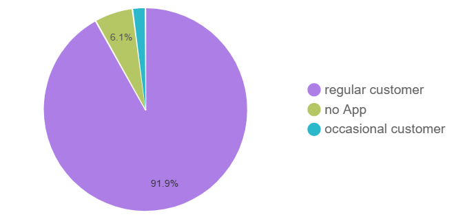
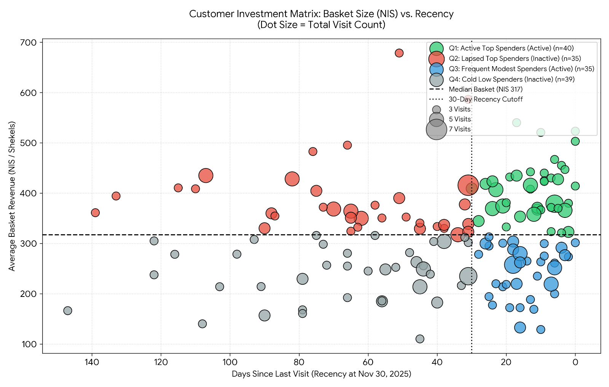
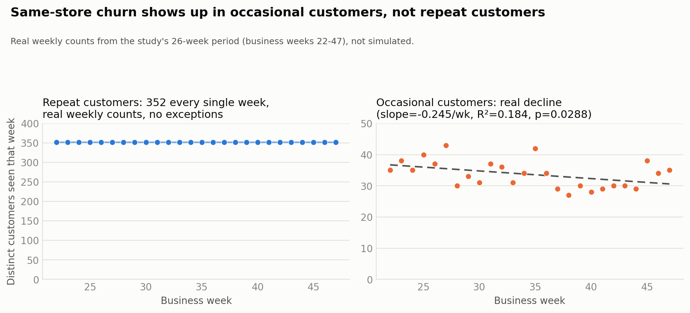
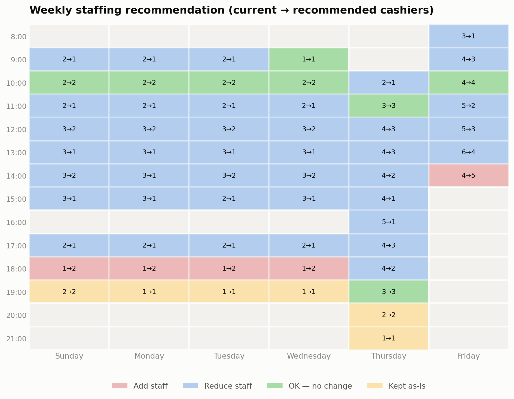
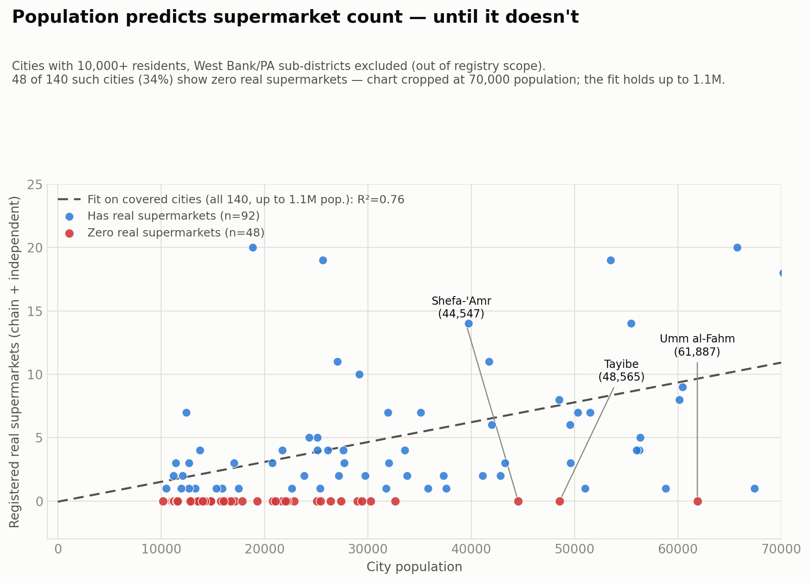

# Retail Analytics — Findings Report

This is a results write-up for the [SQL showcase](./retail_analytics_showcase.sql) and its [README](./README.md): what the queries actually found, with the real numbers behind each claim. The showcase itself is a curated subset of a larger capstone project; this report draws on that full project's results to explain *why* the subset's queries are built the way they are. Where a chart uses a result that isn't reproducible from the trimmed showcase queries alone (the staffing heatmap's exact cell values, the customer-investment-matrix quadrant counts), that's called out explicitly rather than implied.

One methodological note that applies throughout: BigQuery has no built-in significance-testing function, so every p-value quoted here was computed downstream of the SQL, not inside BigQuery itself — originally in Google Sheets, working straight from each query's raw output (see **Tooling** at the end of this report for the Python equivalent, for anyone reproducing this outside Sheets). Correlation and R² are a different matter — where the source query below fits the trend directly in SQL (the per-customer weekly-visit trend and the weekly-revenue trend, both in Section 1), the slope, r, and R² come straight from that query's own output, and only the p-value is computed downstream. The one exception is the population-vs-supermarket-count fit behind the Section 3 chart, where the whole fit (slope, r, R², and p-value alike) is computed downstream from the SQL's raw aggregates. Either way, the SQL's job is always the aggregation (and, where noted, the trend fit itself); significance testing happens afterward, outside BigQuery.

## Section 1 — Revenue & Customer Segmentation

**Who's actually paying, and is anyone leaving?**

Of 1,037 distinct app-linked visitor devices (352 repeat + 409 occasional + 276 non-paying), 352 are repeat customers, 409 are occasional (one-time-tagged but sometimes returning) customers, and 276 devices never complete a purchase at all. A separate 3,596 transactions come through with no linked visitor ID at all. 
Revenue concentrates hard in the repeat group:

Repeat customers are about 46% of identified (app-linked) customers but roughly 92% of revenue — the other two segments barely move the needle. That's the business case for watching the repeat segment closely, and for the churn checks the showcase runs on it specifically.

**Which occasional customers are worth marketing to?** Of the 409 occasional customers, 149 have visited 3+ times. The cutoff sits at 3, not higher, because it doesn't need to be higher: the most any occasional customer visits over the whole study period is 7, and most don't get anywhere near that, so a 3-visit floor already spans the group's real range. Customers with only 1-2 visits are excluded here not because they're one-time buyers, but because two data points aren't enough to say anything meaningful about a customer's own recency/frequency pattern. For the 149 with enough visits to analyze, the showcase computes recency (days since last visit), frequency (total visits), and average basket size per customer: the inputs for a customer investment/priority matrix that splits customers into four quadrants by basket size (above/below the group median) and current activity (visited within the last 30 days of the study window, or gone quiet).

*(The showcase query returns each customer's raw recency, frequency, and basket size; the median-basket split (NIS 317) and 30-day activity cutoff used to assign quadrants here are applied downstream, the same way the staffing heatmap's cell colors are further below.)*

The split comes back close to even across all four quadrants: 40 customers are active top spenders (basket at or above NIS 317, visited within the last 30 days) — the clearest marketing target, since they're proven spenders who are still showing up. 35 are lapsed top spenders — the same high basket size, but gone quiet — a win-back opportunity rather than a lost cause. 35 are frequent modest spenders (active, but below-median basket), and 39 are cold low spenders (below-median basket, gone quiet) — the lowest priority of the four. Visit frequency drops off fast even within this "returning" population: 93 of the 149 (62%) have visited exactly 3 times, tapering to 34 at 4 visits, 18 at 5, and just 4 at 6-7 visits — even the "regulars" among occasional customers rarely settle into a real cadence.

**Two independent churn checks.** Version A splits the study period in half and flags anyone active in the first half with zero activity in the second. this comes back zero, Version B compares each customer's current quiet streak against *their own* typical gap between visits, rather than one fixed cutoff for everyone. comes back near-zero — and the showcase's three-step supporting proof shows exactly why:

*(Real weekly counts from the study's 26-week period, business weeks 22-47 — not a simulated illustration. The regression on the right panel is fit directly on this data: slope -0.245/week, R² = 0.184, p = 0.0288, matching the numbers quoted below.)*

All 352 repeat customers appear in every single week of the ~26-week study period — not roughly all of them, exactly 352, every week, no exceptions. There's no one left to churn. Occasional customers are a different story: their weekly headcount has a real, if modest, downward slope (-0.245/week off a base around 42, p = 0.0288) — this is where the actual customer loss in the dataset is happening, not in the repeat segment.

**So if repeat customers aren't disappearing, why is repeat-customer revenue still declining?** Total weekly revenue declined at a real, statistically solid rate over the 24 non-holiday weeks of the 26-week window (holiday weeks excluded as a confirmed anomaly, not the cause): average weekly revenue NIS 547,940.78, trending down by about NIS 1,860/week (-0.34%/week), R² = 0.397, p = 0.000967. That closely tracks the decline already visible in total weekly transaction counts over the same window (-7.5%, R² = 0.415, p = 0.0007) — not average basket size, which stayed flat (p = 0.65, a non-significant -0.6% change). In other words, revenue is falling because transaction *volume* is falling, not because baskets are getting smaller. Broken out by segment, weekly transaction count tells the real story — and it's worth showing this in raw counts, not just percentages, because the percentages alone make it unclear why the report keeps coming back to the repeat segment specifically:

| Segment | Avg. transactions/week | Weekly slope (real regression) | R² | p-value | Change over the ~24-26 week window |
|---|---|---|---|---|---|
| No-app (phone checkout) | ~140 | -0.67/week | 0.27 | 0.0096 | ≈ -11% |
| Occasional customers | ~35 | -0.22/week | 0.15 | 0.0655 (borderline) | ≈ -14% |
| Repeat customers | ~1,175 | -3.02/week | 0.37 | 0.0018 (highly significant) | ≈ -6% |

The "-11.2%/-14.4%/-6.2%" figures are cumulative change over the whole ~24-26 week study window, not a weekly rate — the weekly slope (a real regression run directly on each segment's weekly transaction counts) is the more precise measure and reproduces the exact same p-values (0.0096 / 0.0655 / 0.0018).

Repeat customers' weekly slope (-3.02/week) is the largest raw loss of the three, roughly 4.5x no-app's (-0.67/week) and about 14x occasional's (-0.22/week) — combined, it's larger than the other two segments' losses put together (-0.89/week). It's also the best-fitting of the three regressions (R² = 0.37, versus 0.27 and 0.15), the most statistically confident (p = 0.0018), and the segment carrying ~92% of revenue (see the pie chart above) — four independent reasons pointing at the same segment, not one percentage figure doing all the work. Repeat customers are still showing up every week (the churn proof above), just visiting somewhat less often than before — a small, real, well-supported effect, not a dramatic one.

**Does that decline concentrate in a few customers, or spread across the whole base?** The showcase fits a least-squares trend line (slope + R²) to each of the 352 repeat customers' own weekly visit counts — no threshold, no "declining" / "stable" / "increasing" labels, just the raw slope and fit quality per customer. No cutoff is applied, because the R² makes any such label indefensible regardless of where the line is drawn: across all 352 customers (holiday weeks and the partial final week excluded), R² averages 0.048, medians 0.023, and tops out at 0.456 for a single customer — only 15 of 352 even clear 0.2. A straight line explains essentially none of any individual customer's own week-to-week variation. No cutoff value turns a fit that weak into someone worth flagging, so the query doesn't produce a flag at all — the honest output is the number, not a verdict on it.

What that low, near-universal R² *does* support, at the population level where noise washes out: the aggregate decline (repeat customers, -6.2%, p = 0.0018, highly significant — see below) is a population-wide softening, not a few identifiable customers driving the number. If it were concentrated in a distinct subgroup, that subgroup's own trend lines would fit meaningfully better than everyone else's — and instead there's a steep drop-off after just one or two customers, then near-uniform noise. Diffused, not concentrated.

## Section 2 — Logistics Optimization: Staffing & Shifts

**Detecting shifts without clock-in data.** Employee shifts are inferred from location-ping gaps rather than a timesheet: each shift is a per-employee-per-day MIN/MAX of that day's pings. That holds up on two points: no employee ever shows more than one detected shift on the same calendar day (confirmed: 0 cases, checked independently via LAG-based gap-detection on raw ping timestamps), and no shift can cross midnight in the first place, since the store isn't open overnight — a structural guarantee from operating hours rather than something that needed its own empirical check.

Headcount and shift length differ a lot by role — cashiers are the largest group (15 people) working relatively short shifts (~6.2 hours) with 3-6 present at a time; roles like security and the senior general worker run much longer average shifts:

| Role | Headcount | Avg. shift length | Avg. staff present/day |
|---|---|---|---|
| Cashier | 15 | 6.2h | 3–6 |
| General worker | 10 | 11.4h | 2.0 |
| Delivery | 8 | 0.5h | 2.0 |
| Butcher | 4 | 8.3h | 2.0 |
| Security | 4 | 13.5h | 1.0 |
| Senior general worker | 1 | 11.7h | 1.0 |
| Manager | 1 | 8.5h | 1.0 |

**Are cashiers staffed to actual demand?** The showcase's weekly staffing diagnostic compares the transactions-per-cashier ratio for every (day-of-week, hour) cell against a policy band (understaffed above 20 on the median measure / 25 on the mean, overstaffed below 12), then backs out a recommended headcount.

Those thresholds aren't arbitrary round numbers — they're checked against two references. First, the data's own ceiling: the single busiest (day, hour) cell in the whole dataset averages 24.97 transactions per cashier per hour, right at the mean threshold — but individual cashier-hours elsewhere in the same dataset reach as high as ~60 transactions, so 25 sits well below what a cashier can actually process, not at some hard capacity wall. Second, an external benchmark: at 25/hour, each transaction gets about 2.4 minutes end-to-end (60 ÷ 25), which lines up closely with a published academic figure for European supermarket checkout throughput (~30 transactions/hour/cashier, cited in the full report) — a bit more conservative than that real-world reference, not detached from it. Sitting well under the dataset's own observed maximum and close to (but under) an external published benchmark is what makes 25 a reasoned threshold rather than a guess.

The two directions of the check are deliberately asymmetric, not mirror images of each other. Flagging *understaffed* uses either signal (median above 20 *or* mean above 25) — a single bad signal is enough, since understaffing is the costlier mistake, and using both catches two different failure modes (a persistently busy typical day, or occasional outlier spikes pulling the average up). Flagging *overstaffed*, by contrast, relies on the median alone — the mean is deliberately excluded from that side of the check, since a single unusually quiet outlier day could otherwise drag the average down and trigger a staffing cut that isn't actually warranted by a typical day. Recommending fewer cashiers rests on the outlier-resistant measure, not the one a single quiet day can swing.

Run on the full dataset, most weekday daytime hours come back overstaffed relative to that band, with a handful of real understaffing pockets late in the day:

*(This heatmap uses the full project's real current→recommended values for illustration — the showcase's own query reproduces the same ratio-and-threshold logic, but this exact grid isn't something the trimmed subset alone regenerates. Each cell's color is set from its own current→recommended numbers.)* The clearest pattern: Thursday afternoons and Friday mornings are consistently the busiest windows and need the most cashiers, while most other weekday midday hours can run leaner than they currently do. One caveat carried over from the showcase's own comments: this reflects the *current* typical supply/demand balance, not a validated demand-satisfying level — store layout, historical staffing habits, and available labor pool all shape today's ratio as much as real demand does.
Summed across every cell in the grid: 158 cashier-hours are currently scheduled across the week against a recommended 103 — 60 hours trimmed from overstaffed slots, offset by 5 hours added back at the four flagged understaffed ones (Sun–Wed 18:00, Fri 14:00), for a net reduction of about 55 cashier-hours per week, roughly 1.4 full-time cashier positions' worth of hours. One caveat carried over from the showcase's own comments: this reflects the *current* typical supply/demand balance, not a validated demand-satisfying level — store layout, historical staffing habits, and available labor pool all shape today's ratio as much as real demand does, so this figure is a reallocation estimate, not a guaranteed labor-cost saving

## Section 3 — Data Quality: Auditing a Public Store Registry

**The goal here is catching problems in the registry data before deciding if it can be used for business recommendations.  ** A raw public supermarket directory, left un-audited, will make some cities look dramatically over- or under-served purely because of duplicate listings, generic placeholder names ("Store," "Kiosk," מכולת), or non-supermarket entries (cafes, gas-station kiosks) counted alongside real supermarkets.

The showcase's pipeline: deduplicate near-duplicate rows using real-world distance (BigQuery GIS `ST_DISTANCE`, not naive lat/lon rounding, which either over- or under-merges), then classify every remaining row by name-matching into chain supermarket / independent supermarket / convenience / specialty / nameless, so a city's population-per-store ratio only counts entries that are actually supermarkets. Run on the full registry, that ratio flags a specific set of cities as potential registry problems — not necessarily true expansion opportunities, but places worth a manual listing check.

Run on the real output, the top of the list is five major, well-known Israeli cities each showing exactly one registered supermarket for tens of thousands of residents: Ramla (88,780 residents), Nazareth (82,161), Kiryat Ata (67,432), Netivot (58,811), and Elad (51,014). A single supermarket registered for an entire city the size of Ramla or Nazareth is exactly the kind of implausible number that either means a real coverage gap or, more likely, a registry that's missing entries for that city. Either way, the finding is a data-quality lead, not a business recommendation on its own.

**That ratio check has a blind spot, though: it can only ever produce a row for a city that already has at least one registered store.** A city with zero registered stores just wouldn't appear in the output above — it would look like the check has nothing to say about it, rather than flagging that the registry is silent on it entirely. A second query fixes this by starting from the census side instead: every populated place, with the cleaned store registry LEFT JOINed onto it, so a true zero shows up as a zero.

Run on the real data: of 1,269 localities in the census table, only 332 have even one registered store. The other 937 have none. Splitting that out matters, because it's not one story — it's two:

135 of those localities (~537,000 people) sit in the seven West Bank/Palestinian Authority sub-districts, which this commercial registry never covers by construction. That's a real, structural scope boundary, not a data-quality problem.

The other 802 (~1.61M people) are ordinary Israeli localities. Most are genuinely small villages where "no listed supermarket" is plausible. But restricting to cities with 10,000+ residents (the same size cutoff the ratio check already treats as individually meaningful) tells a sharper story:

Among 140 such cities (West Bank/PA excluded), population reliably predicts real-supermarket count for the 92 that have any (R² = 0.76, roughly one supermarket per 6,400 residents on the margin) — but 48 of the 140 (34%) sit at zero real supermarkets regardless of population, including cities of 40,000-60,000+ people like Umm al-Fahm, Tayibe, and Shefa-'Amr. Checked by hand: 44 of those 48 are Arab, Druze, or Bedouin towns. That's a demographically patterned gap in what the registry covers, not scattered data-entry noise — a materially stronger "is this registry credible" finding than the per-city ratio check above, and one a business relying on this registry (for store-locator features, market-sizing, expansion planning) should know about before trusting it at face value.

## Tooling

Every query above runs in BigQuery, including the customer-investment-matrix quadrant classification itself (median basket size via `APPROX_QUANTILES`, crossed with the 30-day activity cutoff, all in SQL — see the query's own comments). Everything downstream of BigQuery — every p-value, the two fits that are entirely downstream rather than SQL-backed (the dwell-time-vs-spend regression in Section 1 and the population-vs-supermarket-count fit in Section 3), and every chart image in this report — was originally built in Google Sheets, working straight from each query's exported output, except the customer-investment-matrix chart itself, which was built in Python. For anyone reproducing the Sheets-based parts of this pipeline in code, here's the Python equivalent for each piece (the investment-matrix chart row instead reflects what was actually used):

| Analysis or chart | What it needs | Recommended Python approach |
|---|---|---|
| Any p-value (revenue trend, per-segment transaction-count trends, dwell-time-vs-spend, population-vs-supermarket-count) | Slope, r, R², and p-value from a single bivariate linear fit | `scipy.stats.linregress(x, y)` — returns all four in one call |
| Occasional-customer weekly headcount trend (churn-proof chart, right panel) | Same fit, run on the SQL's raw weekly counts | `scipy.stats.linregress`, on the weekly counts loaded into a `pandas` DataFrame |
| Per-customer visit-trend summary stats (mean/median/max R², count clearing 0.2) | Descriptive stats over 352 already-computed slope/R² pairs | `pandas` (`.describe()`, `.mean()`, `.median()`, boolean filtering) — no refitting needed, since the SQL already computes slope and R² per customer |
| Revenue-mix pie chart | Share of transactions/revenue by segment | `matplotlib.pyplot.pie()` |
| Churn-proof chart (flat line + scatter with trend) | A flat weekly-count line, and a scatter plot with a fitted trend line | `matplotlib` `subplots(1, 2)`; the trend line is the `scipy.stats.linregress` fit plotted with `ax.plot()` |
| Customer-investment-matrix chart *(actually used, not Sheets)* | Bubble chart, colored by quadrant, sized by visit count, with two threshold reference lines | `matplotlib` `ax.scatter(..., s=visit_count, c=quadrant_color)`, plus `ax.axhline()` / `ax.axvline()` for the median-basket and 30-day lines, with a manually built legend — the quadrant label, median, and cutoff all come straight from the query's own output columns, no reclassification needed |
| Staffing heatmap | A day × hour grid with 4 discrete status colors and per-cell text | `matplotlib` `ax.pcolormesh()` with a `matplotlib.colors.ListedColormap`, plus `ax.text()` per cell — a continuous-scale tool like `seaborn.heatmap` is a worse fit here, since the categories are discrete, not a gradient |
| Registry coverage-gap chart | Scatter colored by zero/nonzero, a fitted trend line, and a handful of labeled outlier points | `matplotlib.pyplot.scatter()` plus the `scipy.stats.linregress` fit line and `ax.annotate()` for the labeled cities |
